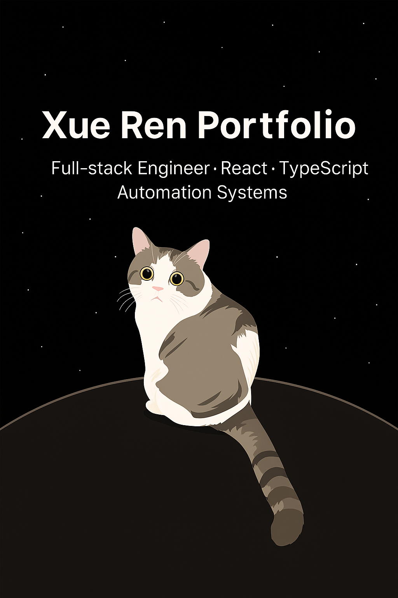

# Xue Ren — Portfolio (Astro + Tailwind + TypeScript)

A fast, minimalist personal portfolio and blog built with **Astro**, **Tailwind CSS**, and **TypeScript** — showcasing my work in **full-stack web development**, and **data-driven dashboards**.

## 🚀 Live

**Website:** [https://xue-ren-portfolio.vercel.app](https://xue-ren-portfolio.vercel.app)

---

## ✨ Highlights

- ✅ 100/100 Lighthouse performance
- ✅ Responsive & Accessible
- ✅ SEO-friendly with auto sitemap and RSS feed
- ✅ Type-safe with Astro Content Collections
- ✅ Light/Dark themes with subtle star and meteor animations
- ✅ Animated UI using SolidJS for interactivity
- ✅ Tailwind styling for a clean, scalable design system
- ✅ MDX support for embedded components
- ✅ Searchable content (posts and projects)
- ✅ Code blocks with copy-to-clipboard

---

## 🛠 Tech Stack

- **Frontend:** Astro · React · SolidJS · TypeScript · Tailwind CSS
- **Backend:** Java · Node.js · Express · REST / GraphQL APIs
- **Data:** SQL · PostgreSQL · MongoDB
- **Deployment:** Vercel · Netlify · GitHub Actions
- **Other:** Docker · Jest · Agile/Scrum

---

## 💼 About This Site

This portfolio represents both my **creative front-end design** and my **engineering experience** connecting real-time manufacturing data with intuitive web interfaces.

It highlights my background in:
- Building **MES-adjacent full-stack apps** and **production dashboards**
- Designing **data visualization** and **monitoring systems** for factories
- Creating **scalable, maintainable UI/UX systems** in TypeScript

---

## ⚙️ Configuration

- Edit global constants in `src/consts.ts`
- Modify text in `src/pages/index.astro` (hero & about section)
- Tailwind settings in `tailwind.config.js`
- Add or update content in `src/content/blog/`, `src/content/projects/`, or `src/content/work/`

---

## 💻 Commands

All commands are run from the project root.

| Command                   | Description |
| :------------------------ | :----------- |
| `npm install`             | Install dependencies |
| `npm run dev`             | Start local dev server at `localhost:4321` |
| `npm run dev:network`     | Start dev server accessible on LAN |
| `npm run sync`            | Generate TypeScript types for all Astro modules |
| `npm run build`           | Build production site to `./dist/` |
| `npm run preview`         | Preview the build locally |
| `npm run preview:network` | Preview on LAN |
| `npm run lint`            | Run ESLint |
| `npm run lint:fix`        | Auto-fix ESLint issues |

> Replace `npm` with your preferred package manager (`pnpm`, `yarn`, or `bun`).

---

## ☁️ Deployment
Current deployment:  
🔗 **https://xue-ren-portfolio.vercel.app**

---

## 🔐 Privacy Policy

A customized Privacy Policy page is available at:  
`src/content/pages/privacy-policy.md`  
It describes how user data is handled for this portfolio site.

---

## 🧭 Roadmap

- ⬜ Table of Contents for articles
- ⬜ Social sharing buttons
- ⬜ Project filtering by tech stack
- ⬜ Site-wide search
- ⬜ English-only and multilingual options

---

## 📫 Contact

- **Email:** [rx1996523@gmail.com](mailto:rx1996523@gmail.com)
- **LinkedIn:** [https://www.linkedin.com/in/xue-ren/](https://www.linkedin.com/in/xue-ren/)

